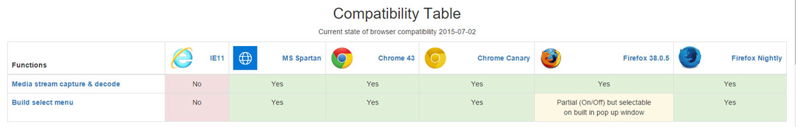
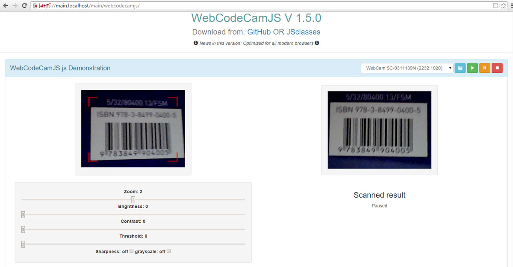

WebCodeCamJS & WebCodeCamJQuery
===============================

New versions of popular WebCodeCam jQuery plugin<br>

    - Very simple usage
    - Some option for optimal result
    - Quick implementation
    - Optimized for all modern browsers

Advantages compared to the previous version:<br>

    - Built in camera selector menu creation
    - Faster
    - Lower CPU and Memory usage
    - More configurable

* [Homepage] - Home page, demonstration




Version
----

2.1.0

    - Extend BuildSelectMenu function


Version
----

2.0.5

    - Add parameter tryVertical to options
    - Some minor modification

Version
----

2.0.1

    - Add parameter successTimeout to options
    - Add parameter codeRepetition to options

Version
----

2.0.0

    - Add UPC-A, UPC-E support, result function return value changed!

Version
----

1.9.1

    - Add default cameraindex parameter to buildSelectMenu, optional

Version
----

1.9.0

    - Add function: decode image from url

Version
----

1.8.0

    - Add function: decode local image

Version
----

1.7.0

    - Add jquery version (WebCodeCamJQuery)

Version
----

1.5.0

    - Optimized for all modern browsers
    - Refactor functions

Version
----

1.0.0

    - Very simple usage
    - Some option for optimal result
    - Quick implementation

Included decoders
-----------

barcode decoder ([DecoderWorker.js])

qr-decoder ([qrcodelib.js])
 

Required HTML & Javascript example
--------------

```sh
<!DOCTYPE html>
<html>
    <head>
        <meta charset="UTF-8">
        <title>Demo</title>
    </head>
    <body>
        <h3>Simple initialization with default settings</h3>
        <hr>
        <canvas></canvas>
        <hr>
        <ul></ul>
        <script type="text/javascript" src="js/qrcodelib.js"></script>
        <script type="text/javascript" src="js/webcodecamjs.js"></script>
        <!-- 
            Using jquery version:
            <script type="text/javascript" src="js/jquery.js"></script>
            <script type="text/javascript" src="js/qrcodelib.js"></script>
            <script type="text/javascript" src="js/webcodecamjquery.js"></script>
        -->
        <script type="text/javascript">
            var txt = "innerText" in HTMLElement.prototype ? "innerText" : "textContent";
            var arg = {
                resultFunction: function(result) {
                    /*
                        result.format: code format,
                        result.code: decoded string,
                        result.imgData: decoded image data
                    */
                    var aChild = document.createElement('li');
                    aChild[txt] = result.format + ': ' + result.code;
                    document.querySelector('body').appendChild(aChild);
                }
            };
    /* -------------------------------------- Available parameters --------------------------------------*/
    var options = {
        DecodeQRCodeRate: 5,                    // null to disable OR int > 0 !
        DecodeBarCodeRate: 5,                   // null to disable OR int > 0 !
        successTimeout: 500,                    // delay time when decoding is succeed
        codeRepetition: true,                   // accept code repetition true or false
        tryVertical: true,                      // try decoding vertically positioned barcode true or false
        frameRate: 15,                          // 1 - 25
        width: 320,                             // canvas width
        height: 240,                            // canvas height
        constraints: {                          // default constraints
            video: {
                mandatory: {
                    maxWidth: 1280,
                    maxHeight: 720
                },
                optional: [{
                    sourceId: true
                }]
            },
            audio: false
        },
        flipVertical: false,                    // boolean
        flipHorizontal: false,                  // boolean
        zoom: -1,                               // if zoom = -1, auto zoom for optimal resolution else int
        beep: 'audio/beep.mp3',                 // string, audio file location
        decoderWorker: 'js/DecoderWorker.js',   // string, DecoderWorker file location
        brightness: 0,                          // int
        autoBrightnessValue: false,             // functional when value autoBrightnessValue is int
        grayScale: false,                       // boolean
        contrast: 0,                            // int
        threshold: 0,                           // int 
        sharpness: [],      // to On declare matrix, example for sharpness ->  [0, -1, 0, -1, 5, -1, 0, -1, 0]
        resultFunction: function(result) {
            /*
                result.format: code format,
                result.code: decoded string,
                result.imgData: decoded image data
            */
            alert(result.code);
        },
        cameraSuccess: function(stream) {           //callback funtion to camera success
            console.log('cameraSuccess');
        },
        canPlayFunction: function() {               //callback funtion to can play
            console.log('canPlayFunction');
        },
        getDevicesError: function(error) {          //callback funtion to get Devices error
            console.log(error);
        },
        getUserMediaError: function(error) {        //callback funtion to get usermedia error
            console.log(error);
        },
        cameraError: function(error) {              //callback funtion to camera error  
            console.log(error);
        }
    };

    /*---------------------------- Example initializations Javascript version ----------------------------*/
    new WebCodeCamJS("canvas").init(arg);
    /* OR */
    var canvas = document.querySelector('#webcodecam-canvas');
    new WebCodeCamJS(canvas).init();
    /* OR */
    new WebCodeCamJS('#webcodecam-canvas').init();

    /*------------------------ Example initializations jquery & Javascript version ------------------------*/
    var decoder = new WebCodeCamJS('#webcodecam-canvas');

    var decoder = $("#webcodecam-canvas").WebCodeCamJQuery(args).data().plugin_WebCodeCamJQuery;

    decoder.buildSelectMenu('#camera-select', sel); //sel : default camera optional
    /* Chrome & MS Edge: build select menu
    *  Firefox: the default camera initializes, return decoder object 
    */
    //simple initialization
    decoder.init();
    /* Select environment camera if available */
    decoder.buildSelectMenu('#camera-select', 'environment|back').init(args);
    /* Select user camera if available */
    decoder.buildSelectMenu('#camera-select', 'user|front').init(args);
    /* Select camera by name */
    decoder.buildSelectMenu('#camera-select', 'facecam').init(args);
    /* Select first camera */
    decoder.buildSelectMenu('#camera-select', 0).init(args);
    /* Select environment camera if available, without visible select menu*/
    decoder.buildSelectMenu(document.createElement('select'), 'environment|back').init().play();   

    /* --------------------------------------- Available Functions: ----------------------------------------*/
    /* camera stop & delete stream */
    decoder.stop();
    /* camera play, restore process */
    decoder.play();
    /* get current image from camera */
    decoder.getLastImageSrc();
    /* decode local image */
    /* if url is defined download image before staring open process */
    decoder.decodeLocalImage(url);
    /* get optimal zoom */
    decoder.getOptimalZoom();
    /* Configurable options */
    decoder.options['parameter'];
    /* Example: 
    ** decoder.options.brightness = 20;         - set brightness to 20
    ** decoder.options.DecodeQRCodeRate = null; - disable qrcode decoder
    */
        </script>
    </body>
</html>
```

License
----

MIT

Author: Tóth András
---
http://atandrastoth.co.uk/

2015-06-10

[Homepage]:http://atandrastoth.co.uk/main/pages/plugins/webcodecamjs/
[WebCodeCamJS]:https://andrastoth.github.io/webcodecamjs/
[DecoderWorker.js]:https://github.com/EddieLa/BarcodeReader
[qrcodelib.js]:https://github.com/LazarSoft/jsqrcode
